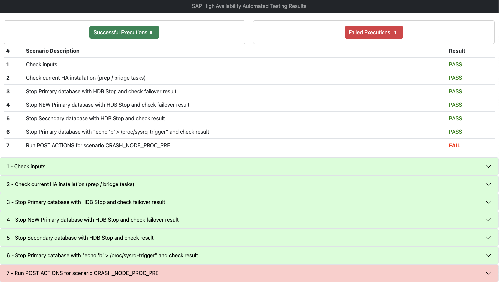

# Automate SAP HANA High Availability Test on AWS

```
Copyright Amazon.com, Inc. or its affiliates. All Rights Reserved.
SPDX-License-Identifier: MIT-0
```

This is an open source repo with sample code to automate the High Availability testing for SAP HANA. This can be either run alone or integrated with the previous solution provided by this team [Install SAP With Jenkins and Ansible](https://github.com/aws-samples/aws-install-sap-with-jenkins-ansible/). 

SAP Software covered with this code:
* SAP HANA - SAP In-Memory Database - verion 1909 - running on RedHat

You can check more details on how to use this repo on this blog post: <insert blog post here>

In the end of the execution, this solution generates an HTML report presenting all the finds and successes/failures of the run. Example below:


## Pre requirements for running this code
<ol>
    <li>One SAP landscape comprised of:
        <ol>
            <li>Two SAP HANA instances with High Availability (HA) previously configured.</li>
            <li>One SAP ASCS instance</li>
            <li>One SAP PAS instance</li>
        </ol>
    </li>
    <li>One AWS IAM Role with the following permissions configured on your local AWS CLI:
        <ol>
            <li>ec2:StartInstances on all instances</li>
            <li>ec2:RebootInstances on all instances</li>
            <li>ec2:StopInstances on all instances</li>
        </ol>
    </li>
    <li>Capture a snapshot of each of the instances you’re involving in this scenario.</li>
</ol>

## Actions performed by this code in your SAP HANA servers

This code will run several commands in your SAP HANA servers to test its High Availability configuration state. They are listed below:

<ol>
    <li>HANA - READ commands
        <ol>
            <li>crm_mon -A1</li>
            <li>HDB proc</li>
            <li>hdbnsutil -sr_state</li>
            <li>hdbsql -i "instance number" -u "system user" -p "system user password" -d SYSTEMDB -m SELECT 1 from users</li>
            <li>hdbuserstore list</li>
            <li>python systemReplicationStatus.py</li>
            <li>sapcontrol -nr "instance number" -function GetProcessList </li>
        </ol>
    </li>
    <li>HANA - WRITE commands
        <ol>
            <li>echo 'b' > /proc/sysrq-trigger</li>
            <li>HDB kill -9</li>
            <li>HDB start</li>
            <li>HDB stop</li>
            <li>hdbnsutil -sr_changemode --mode="mode"</li>
            <li>hdbsql -i "instance number" -u "system user" -p "system user password" -d SYSTEMDB -m "BACKUP DATA FOR {{ GLOBAL_HANA_SID | upper }} USING FILE ('data_bck')"</li>
            <li>hdbsql -i "instance number" -u "system user" -p "system user password" -d SYSTEMDB -m "BACKUP DATA USING FILE ('system_backup')"</li>
            <li>kill -9 "pid"</li>
            <li>pcs node standby</li>
            <li>pcs node unstandby</li>
        </ol>
    </li>
    <li>ASCS - READ commands
        <ol>
            <li>sapcontrol -nr "instance number" -function EnqGetStatistic</li>
        </ol>
    </li>
    <li>PAS - READ commands
        <ol>
            <li>R3trans -d</li>
        </ol>
    </li>
    <li>CONTROLLER (locally) - WRITE commands
        <ol>
            <li>aws ec2 start-instances --region "region" --instance-ids "crashed instance id"</li>
            <li>aws ec2 reboot-instances --region "region" --instance-ids "crashed instance id"</li>
        </ol>
    </li>
</ol>

## Building a lab environment

If you want to build a lab environment to run this code on, take a look at this two other repos:
<ol>
    <li><a href="https://github.com/aws-samples/terraform-aws-sap-netweaver-on-hana">Terraform code to spin up a new SAP landscape</a></li>
    <li><a href="https://github.com/aws-samples/aws-install-sap-with-jenkins-ansible/tree/dev">Jenkins, Ansible and Terraform to create infrastructure and installation with one click</a></li>
</ol>

## How to run

<ol>
    <li>Have access to a terminal on a Linux or Mac computer.</li>
    <li>Have an AWS CLI configured locally </li>
    <li>For each of your servers (HANA Primary, HANA Secondary, ASCS and PAS), update the below information on the file ```hosts.yaml```
        <ol>
            <li>ansible_host</li>
            <li>ansible_user</li>
            <li>ansible_ssh_private_key_file</li>
        </ol>
    </li>
    <li>Open the var_file.yaml and fill in the required information:</li>
</ol>

| Field | Default value | Comments |
| --- | --- | --- |
| <b>Information for HANA</b>
| INPUT_HANA_SID | AD0 | Your HANA SID |
| INPUT_HANA_INSTANCE_NUMBER | 00 | Your HANA instance number |
| INPUT_SYSTEM_USER | SYSTEM | Username for the SYSTEM default user. This will be used to check if a backup is available before starting the tests | 
| INPUT_SYSTEM_PASSWORD | P@ssw0rd | Password for the SYSTEM user.  This will be used to check if a backup is available before starting the tests | 
| INPUT_HANA_SYNC_MODE | SYNC | HANA replication mode | 
| <b>Information for ASCS</b>
| INPUT_ASCS_SID | AD0 | Your ASCS SID | 
| INPUT_ASCS_INSTANCE_NUMBER | 00 | Your ASCS instance number | 
| <b>Information for PAS</b>
| INPUT_PAS_SID | AD0 | Your PAS SID | 
| INPUT_PAS_INSTANCE_NUMBER | 00 | Your PAS instance number | 
| INPUT_CHECK_R3_TRANS | true | Whether to check the R3trans command on PAS after database failovers or not | 
| <b>Information for AWS CLI</b>
| INPUT_AWS_REGION | us | east-1	The region where your instances are | 
| INPUT_AWS_CLI_PROFILE | default | The profile you configured for your AWS CLI on Pre requisites, item 2 | 
| INPUT_PRIVATE_SSH_KEY | /my | path/to/pemFile.pem	Path to the SSH key for Ansible to SSH into your instances  | 

5. And finally, run "how_to_run.sh"

In the end, the generated HTML report will be opened using your default browser automatically.

## Security

See [CONTRIBUTING](CONTRIBUTING.md#security-issue-notifications) for more information.

## License

This library is licensed under the MIT-0 License. See the LICENSE file.